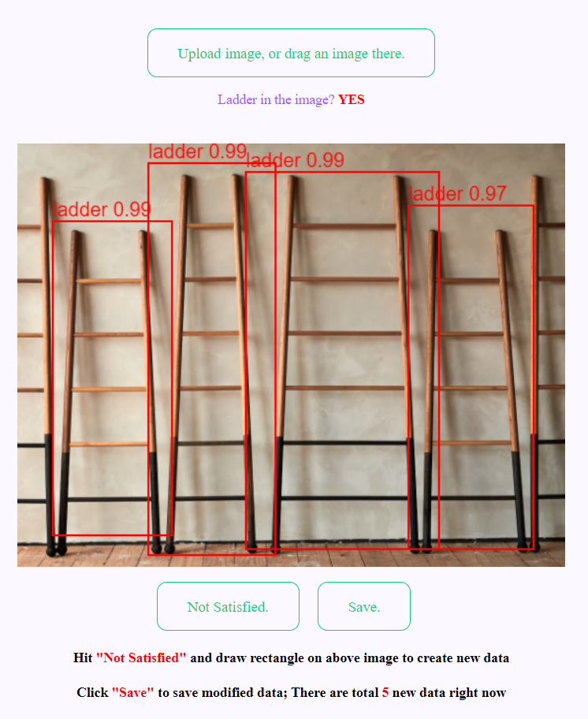
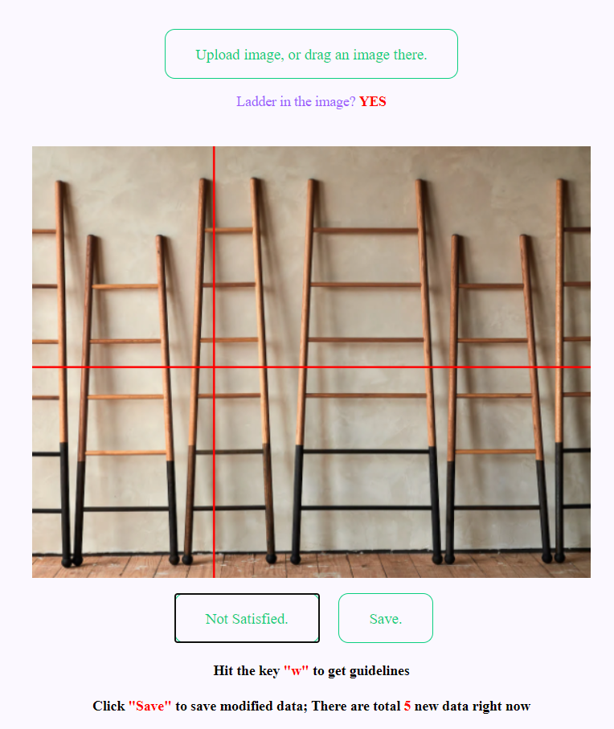

# It serves as three functions

>1. Deploy any object detection trained model
>2. Create ground-truth data by drawing bounding boxes
>3. Automatically continual learning when new data hit certain threshold.

# Usage
1. upload an iamge, the object will be drew a bounding box (you could use other trained algorithm to realize other objec detection)

2. If not satified with the result, click "not satisfied" and trigger the annotation tool to draw bounding boxes youself.
3. Hit "w" to activate the drawing guide lines.

